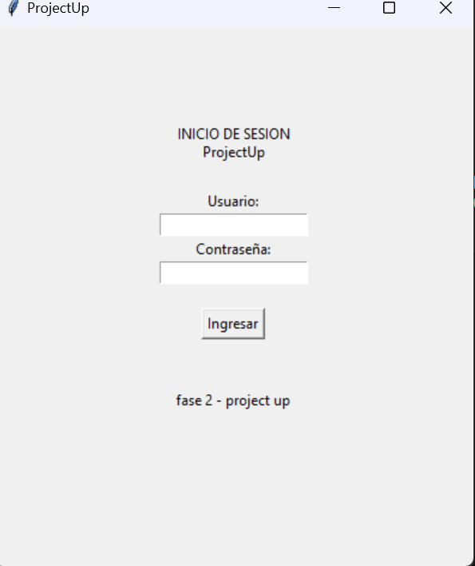
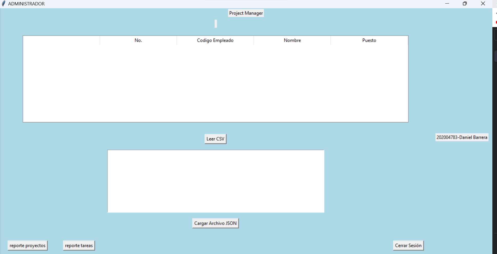
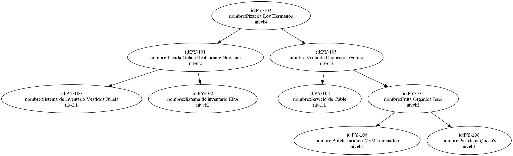
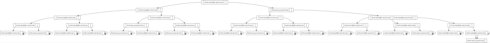

# Manual de Usuario

## Login

Aqui se inicia sesion tanto como para el administrador como para los empleados.

- el usuario de administrador ya esta predeterminado.
- los usuarios y claves de los empleados se tienen que generar por el administrador.

## Ventana Administrador
 
### Boton leer csv

#### este boton se utiliza para poder realizar la carga masiva de los empleados a la tabla desde un archivo csv y asi poder realizar la estructura hash

1. tabla hash

### Boton leer json

#### este boton es utilizado para poder realizar la carga del archivo json y asi poder realizar los respectivos arboles 

 1. arbol AVL
 2. arbol B

 

### Boton reporte proyectos

#### este boton es utilizado para poder realizar el reporte grafico del arbol AVL donde se muestran los proyectos sacados del archivo json 

### Boton reporte Tareas

#### este boton es utilizado para poder realizar el reporte grafico del arbol B donde se muestran las tareas de cada empleado sacados del archivo json 

### Boton cerrar sesion
#### este boton realiza la accion de salir de la ventana y redirigirte al login 

## Ventana Empleados
 
### filtro
#### el filtro sirve para poder ver que proyectos tiene cada empleado y al seleccionar cualquiera te pone en la tabla las tareas que tiene el empleado sobre ese proyecto en especifico

### Boton cerrar sesion
#### este boton realiza la accion de salir de la ventana y redirigirte al login 

